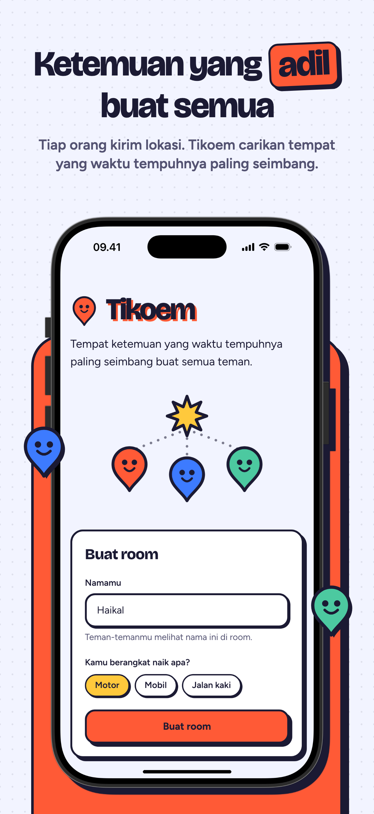
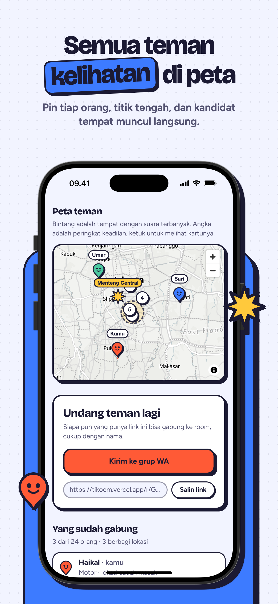
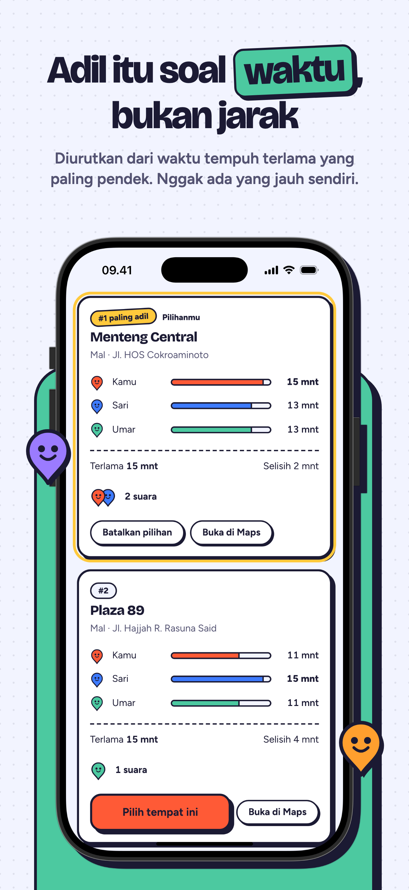
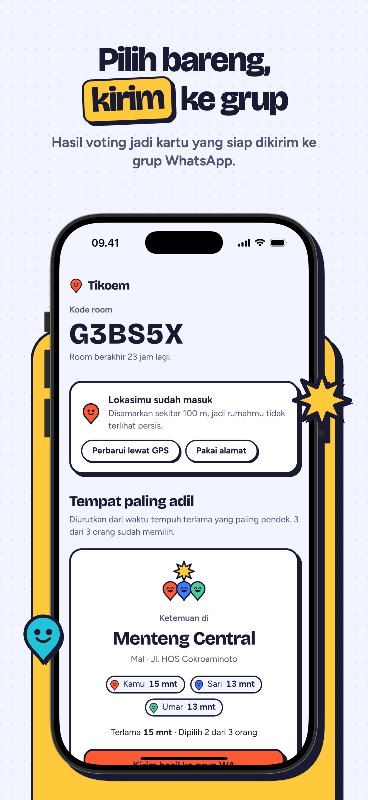
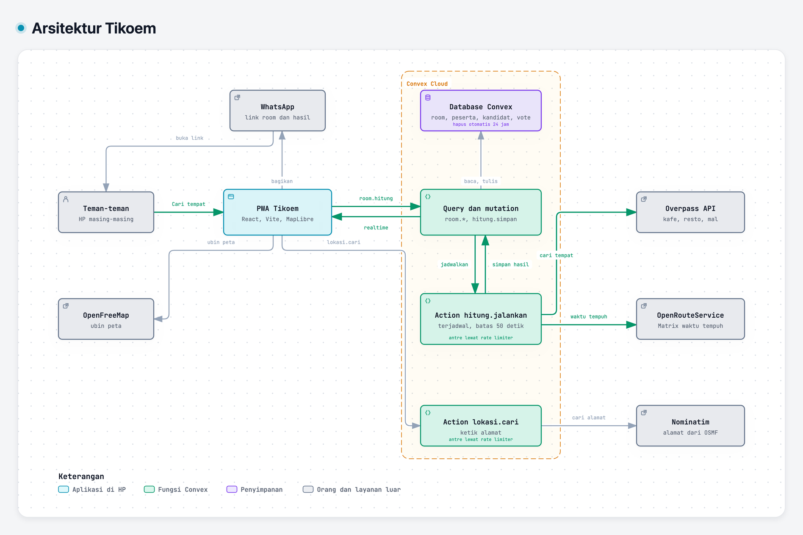

<!-- markdownlint-disable MD033 MD041 -->

<div align="center">


# Tikoem

**Titik kumpul yang adil buat semua.**

Tiap orang kirim lokasinya, Tikoem carikan tempat ketemuan yang waktu tempuhnya paling seimbang.<br />
PWA, tanpa akun.

### [Coba di tikoem.vercel.app →](https://tikoem.vercel.app)

[](https://tikoem.vercel.app)
[](https://www.convex.dev)
[](https://react.dev)
[](https://www.openstreetmap.org)

</div>

<p align="center">
  
  
  
  
</p>

## Cara pakai

1. Buat room, lalu bagikan link-nya ke grup WhatsApp.
2. Tiap teman mengisi nama dan kendaraan, lalu berbagi lokasi lewat GPS atau ketik alamat.
3. Ketuk **Cari tempat**. Tikoem menampilkan 5 tempat dengan waktu tempuh terlama paling pendek, jadi tidak ada yang jauh sendiri.
4. Pilih bareng, lalu kirim kartu hasilnya ke grup.

Satu room muat 24 orang. Nama, lokasi, dan pilihan dihapus otomatis 24 jam setelah room dibuat.

## Cara kerja

<sub>KODE → DIAGRAM · Peta sistem yang menaut ke baris kodenya</sub>

<a href="https://haikalfaruq.github.io/tikoem/arsitektur.html">
<picture>
  <source media="(prefers-color-scheme: dark)" srcset="docs/gambar/arsitektur-gelap.png" />
  
</picture>
</a>

**[Buka diagram interaktif ↗](https://haikalfaruq.github.io/tikoem/arsitektur.html)** · [telusuri jalur Cari tempat ↗](https://haikalfaruq.github.io/tikoem/arsitektur.html#route=teman~ors) · [sumber JSON](docs/arsitektur.archify.json)

- **Adil, bukan sekadar tengah.** Pencarian dimulai dari pusat lingkaran terkecil yang memuat lokasi semua orang. Kandidat dari Overpass diberi waktu tempuh tiap orang lewat OpenRouteService, lalu yang menang adalah tempat dengan waktu tempuh terlama paling pendek.
- **Realtime.** Hitung berjalan di action Convex terjadwal, dan hasilnya langsung sampai ke semua HP di room.
- **Privat.** Lokasi dibulatkan sekitar 100 m, dihapus setelah 24 jam, dan tidak pernah ditulis ke log. Key layanan luar hanya ada di env Convex.

## Jalankan lokal

Butuh Node.js 22 atau lebih baru.

```bash
npm install
npx convex dev   # pilih "Start without an account", biarkan tetap jalan
npm run dev      # di terminal kedua
```

Untuk mencoba **Cari tempat**, isi key OpenRouteService (gratis di [account.heigit.org](https://account.heigit.org/signup)) lewat `npx convex env set ORS_API_KEY <key-mu>`.

Perintah lain, env, batas layanan luar, kontrak data, E2E, dan deploy ada di [`docs/pengembangan.md`](docs/pengembangan.md).

## Tim

<table>
  <tr>
    <td align="center"><a href="https://github.com/HaikalFaruq"><br /><b>Muhammad Haikal Faruq</b></a><br /><sub>Backend, algoritma, deploy</sub></td>
    <td align="center"><a href="https://github.com/bintangfabian"><br /><b>Bintang Fabian Putra</b></a><br /><sub>UI/UX, motion, ilustrasi</sub></td>
  </tr>
</table>

Alur kerjanya ada di [`AGENTS.md`](AGENTS.md). Pertanyaan dan ide dibahas di [Discussions](https://github.com/HaikalFaruq/tikoem/discussions).
