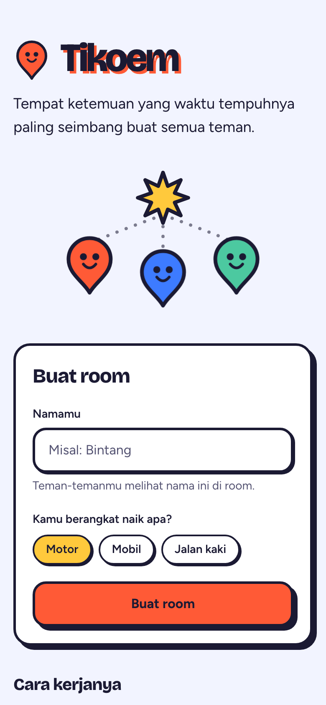
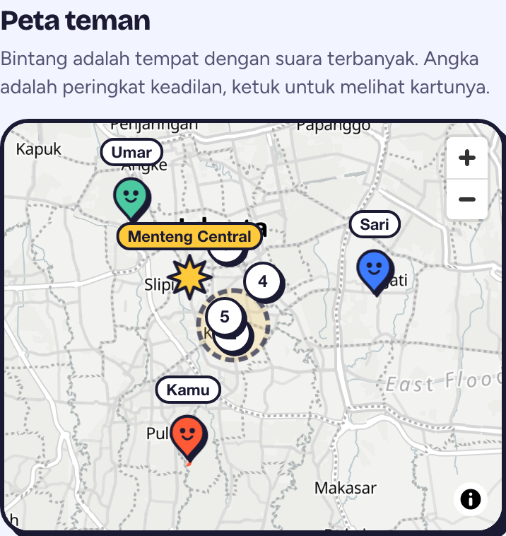
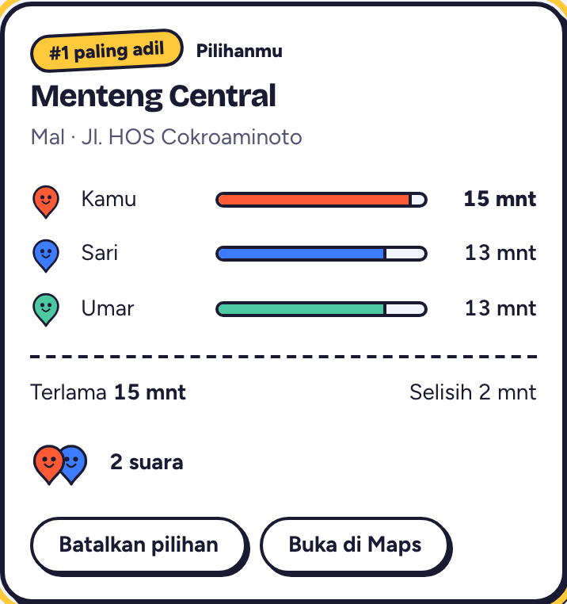
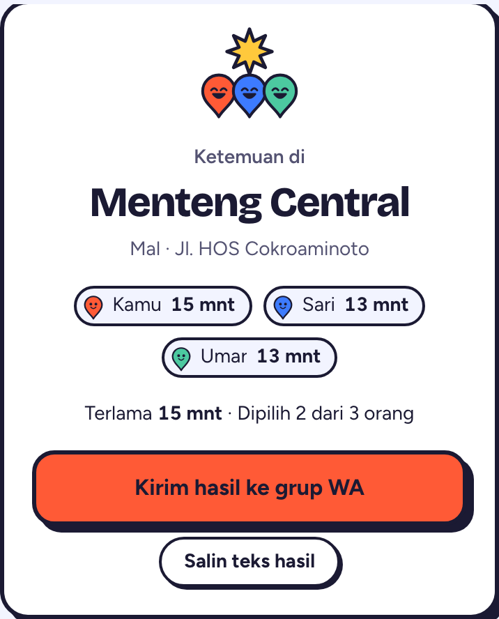
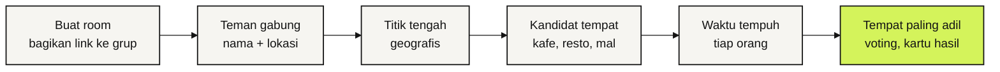

<!-- markdownlint-disable MD033 MD041 -->

<div align="center">

# Tikoem

**Titik kumpul yang adil buat semua.**

Tiap orang kirim lokasinya, Tikoem carikan tempat ketemuan di tengah-tengah<br />
yang waktu tempuhnya paling seimbang. PWA, tanpa akun.

### [Coba di tikoem.vercel.app →](https://tikoem.vercel.app)

[](https://tikoem.vercel.app)
[](https://www.convex.dev)
[](https://react.dev)
[](https://www.typescriptlang.org)
[](https://www.openstreetmap.org)

[Cara pakai](#cara-pakai) · [Cara kerja](#cara-kerja) · [Menjalankan lokal](#menjalankan-lokal) · [Kontrak data](#kontrak-data) · [Tim](#tim) · [Aturan kerja](AGENTS.md)

</div>

> [!NOTE]
> v1 sudah selesai ([roadmap #1](https://github.com/HaikalFaruq/tikoem/issues/1)) dan bisa dipakai di [tikoem.vercel.app](https://tikoem.vercel.app). "Tikoem" masih nama sementara.

## Masalahnya

Mau ketemuan bertiga: rumah Haikal di satu ujung kota, Bintang di ujung lain, Umar entah di mana. Ujung-ujungnya ada yang harus jalan jauh sendiri, atau malah nggak jadi ketemu karena kelamaan debat tempat.

Titik tengah di peta juga belum tentu adil. Bisa jatuh di tengah sungai, di jalan tol, atau di tempat yang dekat secara garis lurus tapi macetnya satu jam.

## Cara pakai

<table>
  <tr>
    <td align="center" valign="top" width="50%"><br /><sub>Buat room</sub></td>
    <td align="center" valign="top" width="50%"><br /><sub>Peta live</sub></td>
  </tr>
  <tr>
    <td align="center" valign="top"><br /><sub>Tempat paling adil</sub></td>
    <td align="center" valign="top"><br /><sub>Kartu hasil</sub></td>
  </tr>
</table>

1. Buka [tikoem.vercel.app](https://tikoem.vercel.app), isi namamu, pilih kendaraan (motor, mobil, atau jalan kaki), lalu ketuk **Buat room**.
2. Bagikan link room ke grup WhatsApp.
3. Tiap teman membuka link itu, mengisi nama dan kendaraan, lalu berbagi lokasi lewat GPS atau mengetik alamat.
4. Setelah minimal 2 orang berbagi lokasi, siapa saja bisa mengetuk **Cari tempat**. Tikoem menampilkan 5 tempat paling adil, lengkap dengan waktu tempuh tiap orang.
5. Semua orang memilih tempat. Tempat dengan suara terbanyak muncul di kartu hasil, yang bisa dikirim balik ke grup lewat **Kirim hasil ke grup WA**.

Beberapa hal yang perlu diketahui:

- Satu room muat sampai 24 orang. Kalau ada yang mengubah lokasinya setelah hasil keluar, hasilnya ditandai usang dan bisa dicari ulang.
- Tikoem bisa dipasang seperti aplikasi lewat menu browser ("Tambahkan ke Layar Utama").
- Nama, lokasi, dan pilihan semua orang dihapus otomatis 24 jam setelah room dibuat. Setelah itu link room-nya hanya menampilkan bahwa room sudah berakhir.

## Cara kerja



1. Tikoem menghitung titik tengah sebagai titik awal pencarian. Titik ini adalah pusat lingkaran terkecil yang memuat lokasi semua orang. Di titik itu, jarak garis lurus ke orang yang paling jauh sekecil mungkin, jadi titiknya tidak condong ke teman-teman yang tinggal berdekatan.
2. Kafe, resto, dan mal yang bernama di sekitar titik itu diambil dari OpenStreetMap lewat Overpass. Kalau tempatnya terlalu sedikit, radius pencarian diperluas sekali.
3. Waktu tempuh dari tiap orang ke tiap tempat dihitung lewat OpenRouteService Matrix. OpenRouteService belum punya profil motor, jadi motor dihitung memakai profil mobil.
4. Yang direkomendasikan adalah tempat dengan **waktu tempuh terlama paling pendek**, jadi tidak ada yang jauh sendiri. Lima tempat teratas ditampilkan, lalu semua orang voting.
5. Kartu hasil menampilkan tempat dengan suara terbanyak. Kalau seri, termasuk kalau belum ada yang voting, tempat dengan peringkat keadilan lebih tinggi yang menang.

## Prinsip

- **Adil, bukan sekadar tengah.** Ukurannya waktu tempuh, bukan jarak garis lurus.
- **Tempat beneran.** Hasilnya kafe, resto, atau mal yang bisa didatangi, bukan titik di peta.
- **Tanpa akun.** Cukup nama untuk gabung ke room.
- **Privat.** Lokasi dibulatkan ke sekitar 100 meter sebelum disimpan, dihapus otomatis 24 jam setelah room dibuat, dan tidak pernah ditulis ke log.

## Stack

| Bagian | Pilihan |
| --- | --- |
| Frontend | Vite, React, TypeScript, Tailwind CSS (termasuk animasinya), PWA lewat vite-plugin-pwa |
| Backend dan database | Convex: query realtime, mutation, action, fungsi terjadwal, dan komponen rate limiter |
| Peta | MapLibre GL + OpenFreeMap |
| Tempat | OpenStreetMap lewat Overpass API |
| Alamat | Nominatim (OpenStreetMap) |
| Waktu tempuh | OpenRouteService Matrix |
| Kualitas | Vitest, Playwright, oxlint, knip, GitHub Actions |
| Deploy | Vercel + Convex Cloud |

Struktur folder dan aturan import antar layer ada di [`AGENTS.md`](AGENTS.md#6-stack-dan-arsitektur). Aturan import itu ikut dicek oleh lint.

## Menjalankan lokal

Butuh Node.js 22 atau lebih baru.

```bash
git clone https://github.com/HaikalFaruq/tikoem.git
cd tikoem
npm install
npx convex dev
```

Pertama kali `npx convex dev` dijalankan, pilih **Start without an account (run Convex locally)**. Backend Convex lalu berjalan di laptop sendiri tanpa akun, dan alamatnya otomatis ditulis ke `.env.local`. Biarkan perintah ini tetap jalan. Selain menyinkronkan folder `convex/` setiap kali ada perubahan, perintah ini juga menjalankan fungsi terjadwal seperti pencarian tempat dan penghapusan room.

Lalu di terminal kedua:

```bash
npm run dev
```

Buka alamat yang muncul di terminal.

| Perintah | Fungsi |
| --- | --- |
| `npx convex dev` | Backend Convex lokal: menyinkronkan `convex/` dan membuat ulang `convex/_generated/` |
| `npm run dev` | Server development frontend |
| `npm run build` | Build production + PWA ke `dist/` |
| `npm run preview` | Menyajikan hasil build secara lokal |
| `npm run typecheck` | Cek tipe TypeScript untuk `src/`, `convex/`, dan `e2e/` |
| `npm run lint` | Lint (oxlint), termasuk aturan import antar layer. Warning dianggap gagal |
| `npm run knip` | Menolak file, export, dan dependensi yang tidak terpakai |
| `npm test` | Unit test (Vitest). `npm run test:watch` untuk mode pantau |
| `npm run test:e2e` | E2E di browser HP (Playwright). Build production dan backend Convex lokal dijalankan otomatis |
| `npm run ikon` | Membuat ulang ikon PWA dan `public/og.png` dari SVG. Jalankan setelah identitas visual berubah |

### Env Convex

Env diisi di deployment Convex lewat `npx convex env set`, tidak pernah lewat variabel `VITE_*` atau file di repo.

| Env | Wajib | Isi |
| --- | --- | --- |
| `ORS_API_KEY` | Untuk **Cari tempat** | Key OpenRouteService. Tanpa key ini, hitung berakhir dengan `LAYANAN_GAGAL`, tapi fitur lain tetap jalan |
| `OVERPASS_URL` | Tidak | Server Overpass pengganti. Kosong berarti server asli, dengan dua server cadangan |
| `ORS_URL` | Tidak | Server OpenRouteService pengganti. Server pengganti tidak memakai antrean batas laju |
| `NOMINATIM_URL` | Tidak | Server Nominatim pengganti. Server pengganti tidak memakai antrean batas laju |

Key OpenRouteService gratis, daftarnya di [account.heigit.org](https://account.heigit.org/signup). Jalankan perintah ini di terminalmu sendiri supaya key-nya tidak tersimpan di mana pun selain Convex:

```bash
npx convex env set ORS_API_KEY <key-mu>
```

### Layanan luar dan batasnya

Semua layanan luar dipanggil dari Convex action, jadi key dan batasnya dijaga di server, bukan di HP.

| Layanan | Dipakai untuk | Batas di Tikoem |
| --- | --- | --- |
| Overpass API | Kandidat tempat | Tiga server ditanya berurutan. Server berikutnya ikut ditanya kalau server sebelumnya gagal atau belum menjawab dalam 4 detik |
| OpenRouteService Matrix | Waktu tempuh | 30 permintaan per menit plus cadangan 10, jadi tidak pernah lebih dari 40 dalam 60 detik (batas paket gratis). Paling banyak 5 yang antre. Kuota hariannya (500) dihitung OpenRouteService sendiri |
| Nominatim (OSMF) | Ketik alamat | Satu permintaan tiap 1,1 detik untuk semua pengguna digabung. Paling banyak 3 yang antre |

Batasnya diatur di [`convex/batasLaju.ts`](convex/batasLaju.ts). Permintaan yang tidak kebagian antrean langsung berakhir dengan `LAYANAN_GAGAL`, tanpa memakai kuota layanannya. Hitung yang belum selesai dalam 50 detik juga berakhir dengan `LAYANAN_GAGAL`, supaya layar bisa menawarkan "Coba lagi". Hitung ulang hanya dijalankan kalau ada lokasi yang berubah sejak hasil terakhir.

### E2E

Pertama kali menjalankan E2E di mesin baru: `npx playwright install --only-shell chromium`.

E2E memakai backend Convex lokal di `127.0.0.1:3210`, jadi pilih deployment lokal saat pertama kali menjalankan `npx convex dev`. Kalau `npx convex dev` sudah jalan, E2E memakai backend itu. Kalau belum, E2E menyalakannya sendiri lalu mematikannya lagi. Room yang dibuat E2E ikut tersimpan di deployment lokalmu. Di CI, backend-nya dibuat baru tanpa akun setiap kali jalan.

Overpass, OpenRouteService, dan Nominatim tidak dipanggil sungguhan saat E2E. Di CI, ketiganya selalu diganti server tiruan (`e2e/layanan-tiruan.ts`). Di laptop, E2E yang butuh layanan itu dilewati, kecuali dijalankan dengan:

```bash
E2E_LAYANAN_TIRUAN=1 npm run test:e2e
```

Selama E2E berjalan, env `OVERPASS_URL`, `ORS_URL`, dan `NOMINATIM_URL` di deployment Convex-mu diarahkan ke server tiruan. Setelah selesai, env-nya dikembalikan. Untuk menguji keadaan gagal, taruh peserta di `LOKASI_TANPA_TEMPAT` atau `LOKASI_LAYANAN_GAGAL` dari `e2e/backend.ts`.

`convex/_generated/` ikut di-commit supaya typecheck dan CI jalan tanpa backend. Isinya dibuat ulang oleh `npx convex dev`, jadi commit perubahannya bersama perubahan di `convex/`.

### Kalau ada masalah

| Gejala | Penyebab yang biasa |
| --- | --- |
| **Cari tempat** selalu berakhir "layanan gagal" | `ORS_API_KEY` belum diisi, kuota harian OpenRouteService habis, atau Overpass sedang sibuk. Cek log di terminal `npx convex dev`, atau di dashboard Convex untuk production |
| Hitung yang dimulai lewat `npx convex run` tidak pernah selesai | Kalau `npx convex dev` tidak menyala, `npx convex run` hanya menyalakan backend lokal selama satu panggilan, jadi fungsi terjadwal ikut berhenti. Biarkan `npx convex dev` jalan di terminal lain |
| E2E di laptop banyak yang dilewati (skipped) | Jalankan dengan `E2E_LAYANAN_TIRUAN=1` |
| Typecheck gagal setelah mengubah `convex/` | `convex/_generated/` belum dibuat ulang. Jalankan `npx convex dev` sekali |

## Kontrak data

Frontend hanya bicara dengan backend lewat fungsi Convex di bawah ini (`api.<modul>.<fungsi>`). Perubahan bentuknya dibahas dulu di issue atau Discussions (lihat [`AGENTS.md`](AGENTS.md#3-pembagian-peran)). Kesepakatan awalnya ada di [Discussions #8](https://github.com/HaikalFaruq/tikoem/discussions/8).

| Fungsi | Jenis | Isi |
| --- | --- | --- |
| `room.buat({ nama, kendaraan })` | mutation | Room baru dengan kode 6 karakter. Pembuatnya langsung jadi peserta pertama. Mengembalikan `{ kode, pesertaId, kunci, urutanGabung }` |
| `room.gabung({ kode, nama, kendaraan })` | mutation | Gabung ke room. Mengembalikan `{ pesertaId, kunci, urutanGabung }` |
| `room.kirimLokasi({ pesertaId, kunci, lokasi })` | mutation | Simpan lokasi yang sudah dibulatkan. Hasil yang sudah keluar ditandai usang |
| `room.hitung({ pesertaId, kunci })` | mutation | Mulai mencari tempat di latar. Tidak melakukan apa-apa kalau hasilnya masih berlaku |
| `room.vote({ pesertaId, kunci, kandidatId })` | mutation | Pilih tempat. `kandidatId: null` membatalkan pilihan |
| `room.keluar({ pesertaId, kunci })` | mutation | Hapus nama, lokasi, dan pilihan orang itu dari room |
| `room.lihat({ kode })` | query | Room, peserta, dan kandidat secara realtime, atau `{ ok: false, galat }` |
| `lokasi.cari({ teks })` | action | Cari alamat lewat Nominatim untuk fitur ketik alamat |

`pesertaId` dan `kunci` adalah identitas "ini aku" di sebuah room, disimpan di `localStorage` HP itu saja. Galat dikirim sebagai kode di `error.data.galat` (mutation dan action) atau `galat` (query). Daftar lengkapnya ada di tipe `Galat` di [`convex/room.ts`](convex/room.ts), ditambah `galatHitung` untuk hasil pencarian: `TEMPAT_TIDAK_DITEMUKAN` atau `LAYANAN_GAGAL`.

## Gerbang mutu

CI di GitHub Actions menjalankan semuanya di setiap PR dan setiap push ke `main`:

```bash
npm run typecheck   # tsc: src, convex, e2e
npm run lint        # oxlint: React hooks, aksesibilitas, TypeScript, batas antar layer
npm run knip        # file, export, dan dependensi yang tidak terpakai
npm test            # Vitest: domain, lib, convex
npm run test:e2e    # Playwright: alur pengguna di layar HP, dengan backend Convex lokal
```

Perilaku baru wajib disertai test: logika di unit test, alur pengguna di E2E. Tampilan dicek di lebar 320 px dan 390 px, mode terang dan gelap.

## Deploy

Frontend di Vercel dan backend di Convex production, dua-duanya dibangun dari `main`. `vercel.json` sudah mengatur hal-hal ini:

- **Build:** Vercel menjalankan `npx convex deploy` dulu, lalu `npm run build` dengan `VITE_CONVEX_URL` milik production.
- **Link room:** alamat seperti `/r/ABC234` diarahkan ke app, jadi link yang dibuka langsung dari WhatsApp tidak 404.
- **Service worker:** `sw.js` tidak di-cache browser, jadi versi baru PWA cepat sampai.
- **Hanya `main`:** build untuk branch lain dilewati, karena key Convex hanya untuk production. Pengecekannya memakai nama branch (`VERCEL_GIT_COMMIT_REF`), bukan `VERCEL_ENV` (lihat #34).

Setiap push ke `main` mendapat status commit `Vercel`. Kalau isinya "Deployment has completed", frontend dan backend production sudah memakai kode terbaru.

Penyiapan sekali saja:

1. Di dashboard Convex, buka project `tikoem`, deployment Production, lalu Settings. Buat **Production Deploy Key**.
2. Di Vercel, import repo ini dari GitHub. Framework Vite terdeteksi otomatis.
3. Tambahkan env `CONVEX_DEPLOY_KEY` berisi key tadi, untuk environment Production saja. Lalu deploy.
4. Isi key OpenRouteService di production, lewat terminalmu sendiri:

   ```bash
   npx convex env set ORS_API_KEY <key-mu> --prod
   ```

5. Tulis alamat Vercel-nya di About repo.

## Tim

<table>
  <tr>
    <td align="center"><a href="https://github.com/HaikalFaruq"><br /><b>Muhammad Haikal Faruq</b></a><br /><sub>Backend: data, Convex, algoritma, deploy</sub></td>
    <td align="center"><a href="https://github.com/bintangfabian"><br /><b>Bintang Fabian Putra</b></a><br /><sub>Frontend: UI/UX, motion, ilustrasi</sub></td>
  </tr>
</table>

## Berkontribusi

Alur kerja lengkapnya ada di [`AGENTS.md`](AGENTS.md): Issue → branch → PR → merge commit, dengan pasangan sebagai co-author dan tanpa atribusi AI. Pertanyaan teknis dan desain dibahas di [Discussions](https://github.com/HaikalFaruq/tikoem/discussions).
