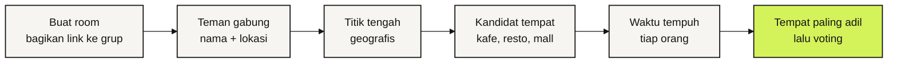

<!-- markdownlint-disable MD033 MD041 -->

<div align="center">

# Tikoem

**Titik kumpul yang adil buat semua.**

Tiap orang kirim lokasinya, Tikoem carikan tempat ketemuan di tengah-tengah<br />
yang waktu tempuhnya paling seimbang. PWA, tanpa akun.

[](https://github.com/HaikalFaruq/tikoem/issues/1)
[](https://www.convex.dev)
[](https://react.dev)
[](https://www.typescriptlang.org)
[](https://www.openstreetmap.org)

[Roadmap](https://github.com/HaikalFaruq/tikoem/issues/1) · [Cara kerja](#cara-kerja) · [Menjalankan lokal](#menjalankan-lokal) · [Tim](#tim) · [Aturan kerja](AGENTS.md)

</div>

> [!NOTE]
> Tikoem baru dimulai. Rencana dan pembagian kerjanya ada di [roadmap #1](https://github.com/HaikalFaruq/tikoem/issues/1). "Tikoem" masih nama sementara.

## Masalahnya

Mau ketemuan bertiga: rumah Haikal di satu ujung kota, Bintang di ujung lain, Umar entah di mana. Ujung-ujungnya ada yang harus jalan jauh sendiri, atau malah nggak jadi ketemu karena kelamaan debat tempat.

Titik tengah di peta juga belum tentu adil. Bisa jatuh di tengah sungai, di jalan tol, atau di tempat yang dekat secara garis lurus tapi macetnya satu jam.

## Cara kerja



1. Satu orang membuat room, lalu link-nya dibagikan ke grup WA.
2. Setiap teman membuka link, mengisi nama, lalu mengizinkan lokasi atau mengetik alamat.
3. Tikoem menghitung titik tengah sebagai titik awal pencarian. Titik ini adalah pusat lingkaran terkecil yang memuat lokasi semua orang. Di titik itu, jarak garis lurus ke orang yang paling jauh sekecil mungkin, jadi titiknya tidak condong ke teman-teman yang tinggal berdekatan.
4. Tempat nyata di sekitarnya diambil dari OpenStreetMap.
5. Untuk setiap tempat, waktu tempuh dari tiap orang dihitung lewat OpenRouteService.
6. Yang direkomendasikan adalah tempat dengan **waktu tempuh terlama paling pendek**, jadi tidak ada yang jauh sendiri. Setelah itu semua orang voting.

## Prinsip

- **Adil, bukan sekadar tengah.** Ukurannya waktu tempuh, bukan jarak garis lurus.
- **Tempat beneran.** Hasilnya kafe, resto, mall, atau stasiun yang bisa didatangi, bukan titik di peta.
- **Tanpa akun.** Cukup nama untuk gabung ke room.
- **Privat.** Lokasi dihapus otomatis 24 jam setelah room dibuat, dan tidak pernah ditulis ke log.

## Stack

| Bagian | Pilihan |
| --- | --- |
| Frontend | Vite, React, TypeScript, Tailwind CSS, Motion, PWA |
| Backend dan database | Convex: query realtime, mutation, action, cron |
| Peta | MapLibre GL + OpenFreeMap |
| Tempat | OpenStreetMap lewat Overpass API |
| Waktu tempuh | OpenRouteService Matrix |
| Kualitas | Vitest, Playwright, oxlint, GitHub Actions |
| Deploy | Vercel + Convex Cloud |

Struktur folder dan aturan import antar layer ada di [`AGENTS.md`](AGENTS.md#6-stack-dan-arsitektur). Aturan import itu ikut dicek oleh lint.

## Menjalankan lokal

Butuh Node.js 22 atau lebih baru.

```bash
git clone https://github.com/HaikalFaruq/tikoem.git
cd tikoem
npm install
npx convex dev
```

Pertama kali `npx convex dev` dijalankan, pilih **Start without an account (run Convex locally)**. Backend Convex lalu berjalan di laptop sendiri tanpa akun, dan alamatnya otomatis ditulis ke `.env.local`. Biarkan perintah ini tetap jalan, karena ia menyinkronkan folder `convex/` setiap kali ada perubahan.

Lalu di terminal kedua:

```bash
npm run dev
```

Buka alamat yang muncul di terminal.

| Perintah | Fungsi |
| --- | --- |
| `npx convex dev` | Backend Convex lokal: menyinkronkan `convex/` dan membuat ulang `convex/_generated/` |
| `npm run dev` | Server development frontend |
| `npm run build` | Build production + PWA ke `dist/` |
| `npm run preview` | Menyajikan hasil build secara lokal |
| `npm run typecheck` | Cek tipe TypeScript untuk `src/`, `convex/`, dan `e2e/` |
| `npm run lint` | Lint (oxlint), termasuk aturan import antar layer. Warning dianggap gagal |
| `npm test` | Unit test (Vitest) |
| `npm run test:e2e` | E2E di browser HP (Playwright). Build production dan backend Convex lokal dijalankan otomatis |

Untuk mencoba tombol "Cari tempat" di lokal, isi key OpenRouteService di deployment Convex-mu. Daftarnya gratis di [account.heigit.org](https://account.heigit.org/signup). Jalankan perintah ini di terminalmu sendiri supaya key-nya tidak tersimpan di mana pun selain Convex:

```bash
npx convex env set ORS_API_KEY <key-mu>
```

Tanpa key ini, hitung berakhir dengan `LAYANAN_GAGAL`. Fitur lain tetap jalan.

Pertama kali menjalankan E2E di mesin baru: `npx playwright install --only-shell chromium`.

E2E memakai backend Convex lokal di `127.0.0.1:3210`, jadi pilih deployment lokal saat pertama kali menjalankan `npx convex dev`. Kalau `npx convex dev` sudah jalan, E2E memakai backend itu. Kalau belum, E2E menyalakannya sendiri lalu mematikannya lagi. Room yang dibuat E2E ikut tersimpan di deployment lokalmu. Di CI, backend-nya dibuat baru tanpa akun setiap kali jalan.

Overpass, OpenRouteService, dan Nominatim tidak dipanggil sungguhan saat E2E. Di CI, ketiganya selalu diganti server tiruan (`e2e/layanan-tiruan.ts`). Di laptop, E2E yang butuh layanan itu dilewati, kecuali dijalankan dengan:

```bash
E2E_LAYANAN_TIRUAN=1 npm run test:e2e
```

Selama E2E berjalan, env `OVERPASS_URL`, `ORS_URL`, dan `NOMINATIM_URL` di deployment Convex-mu diarahkan ke server tiruan. Setelah selesai, env-nya dikembalikan. Kalau ketiga env itu kosong, backend memakai server asli. Untuk menguji keadaan gagal, taruh peserta di `LOKASI_TANPA_TEMPAT` atau `LOKASI_LAYANAN_GAGAL` dari `e2e/backend.ts`.

`convex/_generated/` ikut di-commit supaya typecheck dan CI jalan tanpa backend. Isinya dibuat ulang oleh `npx convex dev`, jadi commit perubahannya bersama perubahan di `convex/`.

## Gerbang mutu

CI di GitHub Actions menjalankan semuanya di setiap PR dan setiap push ke `main`:

```bash
npm run typecheck   # tsc: src, convex, e2e
npm run lint        # oxlint: React hooks, aksesibilitas, TypeScript, batas antar layer
npm test            # Vitest: domain, lib, convex
npm run test:e2e    # Playwright: alur pengguna di layar HP, dengan backend Convex lokal
```

Perilaku baru wajib disertai test: logika di unit test, alur pengguna di E2E. Tampilan dicek di lebar 320 px dan 390 px, mode terang dan gelap.

## Deploy

Frontend di Vercel dan backend di Convex production, dua-duanya dibangun dari `main`. `vercel.json` sudah mengatur hal-hal ini:

- **Build:** Vercel menjalankan `npx convex deploy` dulu, lalu `npm run build` dengan `VITE_CONVEX_URL` milik production.
- **Link room:** alamat seperti `/r/ABC234` diarahkan ke app, jadi link yang dibuka langsung dari WhatsApp tidak 404.
- **Service worker:** `sw.js` tidak di-cache browser, jadi versi baru PWA cepat sampai.
- **Pratinjau:** build pratinjau untuk branch selain `main` dilewati, karena key Convex hanya untuk production.

Penyiapan sekali saja:

1. Di dashboard Convex, buka project `tikoem`, deployment Production, lalu Settings. Buat **Production Deploy Key**.
2. Di Vercel, import repo ini dari GitHub. Framework Vite terdeteksi otomatis.
3. Tambahkan env `CONVEX_DEPLOY_KEY` berisi key tadi, untuk environment Production saja. Lalu deploy.
4. Isi key OpenRouteService di production, lewat terminalmu sendiri:

   ```bash
   npx convex env set ORS_API_KEY <key-mu> --prod
   ```

5. Tulis alamat Vercel-nya di About repo.

## Tim

<table>
  <tr>
    <td align="center"><a href="https://github.com/HaikalFaruq"><br /><b>Muhammad Haikal Faruq</b></a><br /><sub>Backend: data, Convex, algoritma, deploy</sub></td>
    <td align="center"><a href="https://github.com/bintangfabian"><br /><b>Bintang Fabian Putra</b></a><br /><sub>Frontend: UI/UX, motion, ilustrasi</sub></td>
  </tr>
</table>

## Berkontribusi

Alur kerja lengkapnya ada di [`AGENTS.md`](AGENTS.md): Issue → branch → PR → merge commit, dengan pasangan sebagai co-author dan tanpa atribusi AI. Pertanyaan teknis dan desain dibahas di [Discussions](https://github.com/HaikalFaruq/tikoem/discussions).
