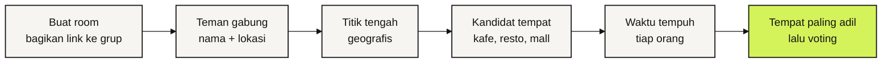

<!-- markdownlint-disable MD033 MD041 -->

# Tikoem

**Titik kumpul yang adil buat semua.**

Tiap orang kirim lokasinya, Tikoem carikan tempat ketemuan di tengah-tengah 
yang waktu tempuhnya paling seimbang. PWA, tanpa akun.

[Roadmap](https://github.com/HaikalFaruq/tikoem/issues/1) · [Cara kerja](#cara-kerja) · [Tim](#tim) · [Aturan kerja](AGENTS.md)

> [!NOTE]
> Tikoem baru dimulai. Rencana dan pembagian kerjanya ada di [roadmap #1](https://github.com/HaikalFaruq/tikoem/issues/1). "Tikoem" masih nama sementara.

## Masalahnya

Mau ketemuan bertiga: rumah Haikal di satu ujung kota, Bintang di ujung lain, Umar entah di mana. Ujung-ujungnya ada yang harus jalan jauh sendiri, atau malah nggak jadi ketemu karena kelamaan debat tempat.

Titik tengah di peta juga belum tentu adil. Bisa jatuh di tengah sungai, di jalan tol, atau di tempat yang dekat secara garis lurus tapi macetnya satu jam.

## Cara kerja

1. Satu orang membuat room, lalu link-nya dibagikan ke grup WA.
2. Setiap teman membuka link, mengisi nama, lalu mengizinkan lokasi atau mengetik alamat.
3. Tikoem menghitung titik tengah geografis sebagai titik awal pencarian.
4. Tempat nyata di sekitarnya diambil dari OpenStreetMap.
5. Untuk setiap tempat, waktu tempuh dari tiap orang dihitung lewat OpenRouteService.
6. Yang direkomendasikan adalah tempat dengan **waktu tempuh terlama paling pendek**, jadi tidak ada yang jauh sendiri. Setelah itu semua orang voting.

## Prinsip

- **Adil, bukan sekadar tengah.** Ukurannya waktu tempuh, bukan jarak garis lurus.
- **Tempat beneran.** Hasilnya kafe, resto, mall, atau stasiun yang bisa didatangi, bukan titik di peta.
- **Tanpa akun.** Cukup nama untuk gabung ke room.
- **Privat.** Lokasi dihapus otomatis 24 jam setelah room dibuat, dan tidak pernah ditulis ke log.

## Stack

| Bagian | Pilihan |
| --- | --- |
| Frontend | Vite, React, TypeScript, Tailwind CSS, Motion, PWA |
| Backend dan database | Convex: query realtime, mutation, action, cron |
| Peta | MapLibre GL + OpenFreeMap |
| Tempat | OpenStreetMap lewat Overpass API |
| Waktu tempuh | OpenRouteService Matrix |
| Deploy | Vercel + Convex Cloud |

Struktur folder dan aturan import antar layer ada di [`AGENTS.md`](AGENTS.md#6-stack-dan-arsitektur). Cara menjalankan lokal ditulis setelah fondasi app masuk.

## Tim

<table>
  <tr>
    <td align="center"><a href="https://github.com/HaikalFaruq"> <b>Muhammad Haikal Faruq</b></a> Backend: data, Convex, algoritma, deploy</td>
    <td align="center"><a href="https://github.com/bintangfabian"> <b>Bintang Fabian Putra</b></a> Frontend: UI/UX, motion, ilustrasi</td>
  </tr>
</table>

## Berkontribusi

Alur kerja lengkapnya ada di [`AGENTS.md`](AGENTS.md): Issue → branch → PR → merge commit, dengan pasangan sebagai co-author dan tanpa atribusi AI. Pertanyaan teknis dan desain dibahas di [Discussions](https://github.com/HaikalFaruq/tikoem/discussions).
